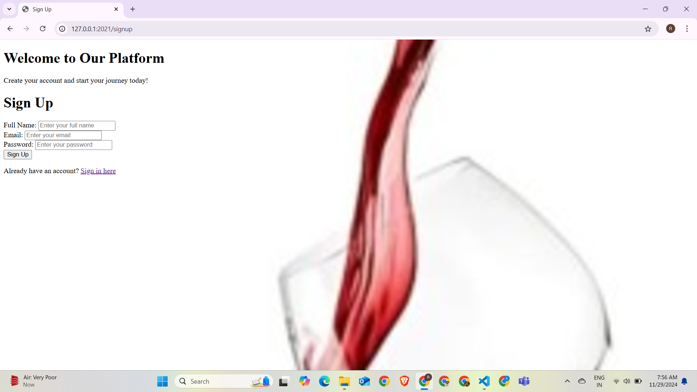
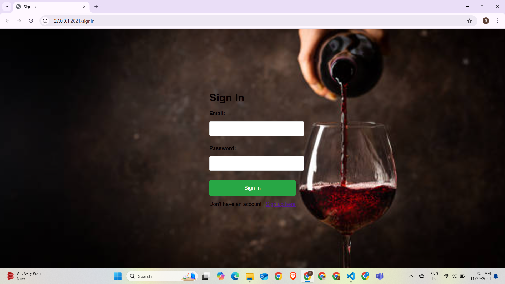
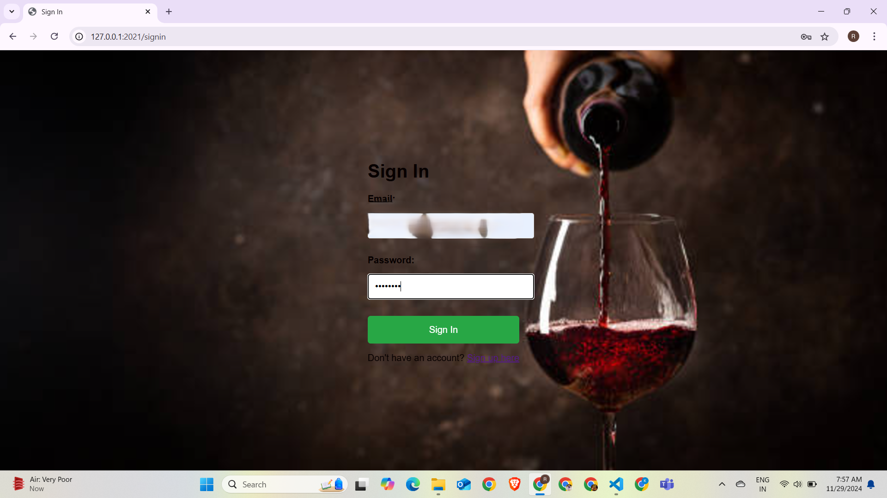
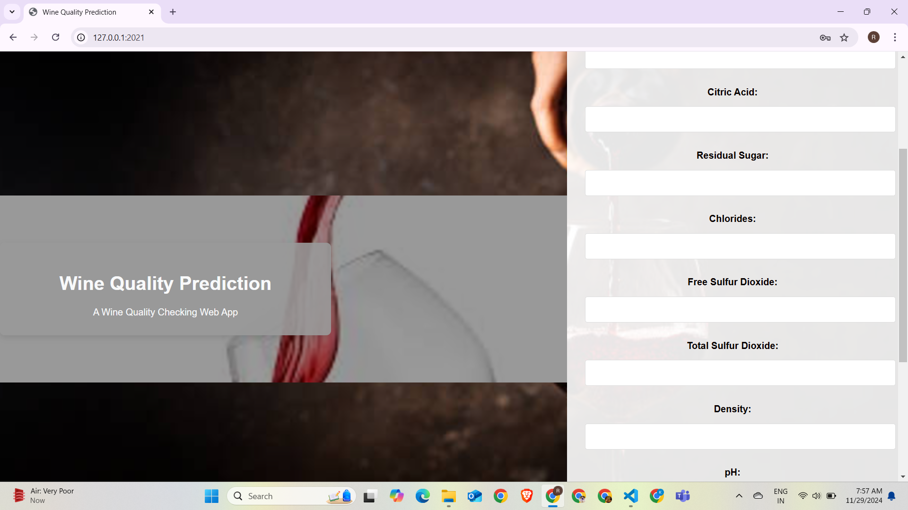
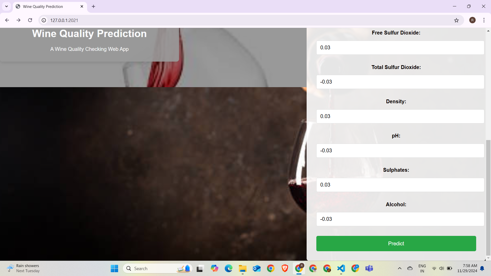
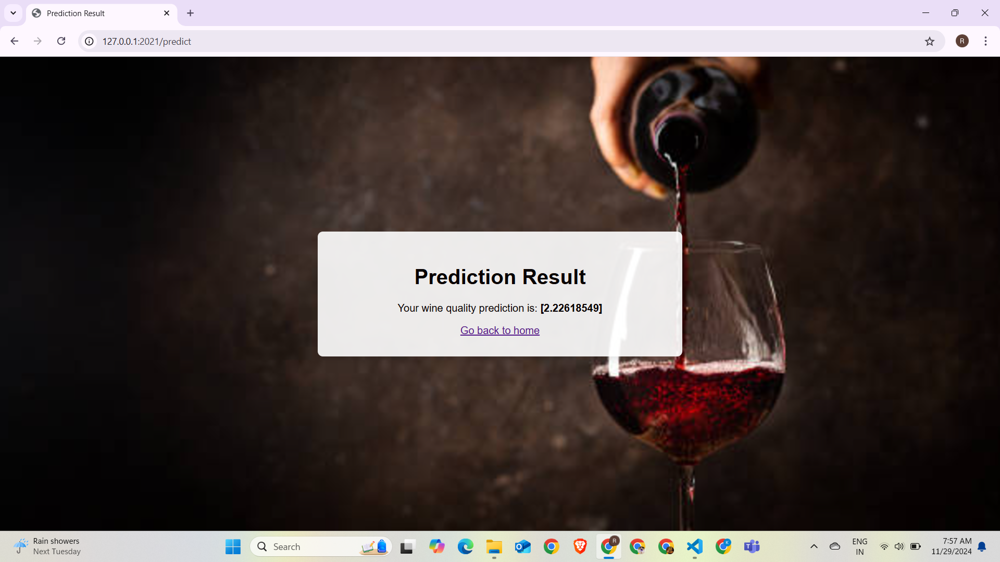

# Ramyasreekodati-END-TO-END-MACHINE-LEARNING-PROJECT
End-to-End Machine Learning Project
Welcome to the End-to-End Machine Learning Project repository! This project demonstrates the complete lifecycle of a machine learning workflow, from data preparation to deployment, ensuring a scalable and maintainable solution.

""" 
End to end ml Project Implementation
1. Introduction
2. GitHub Repo setup
3. Project Template creation
4. project setup
5. Logging , Exception and Utility
6. Project Workflows
7. Notepad Experiment's
8. Components Implementation
	Data Ingestion
	Data Validation
	Data Transformation
	Data Training
	Data Evaluation
9.  Training pipeline
10. Prediction Pipeline
11. User APP Implementation's
12. Decentralization
13. Deployment on AWS --> CI/CD

"""

#Clone the repository
''''
bash

https://github.com/Ramyasreekodati/END-TO-END-MACHINE-LEARNING-PROJECT.git

'''

### Create a conda environment after opening the repository

```bash
conda create -n mlproj python=3.8 -y
```

```bash
conda activate mlproj
```

```bash
pip install -r requirements.txt
```

```bash
python app.py
```
'''bash
now open up your local host 0.0.0.0 : 2021
'''


get config --global user.name "Ramyasreekodati"
get config --global user.email "ramyasreekodati@gmail.com"

## Workflows

1. Update config.yaml
2. Update schema.yaml
3. Update params.yaml
4. Update the entity
5. Update the configuration manager in src config
6. Update the components
7. Update the pipeline 
8. Update the main.py
9. Update the app.py


# Directory Structure

├── research  
│   ├── 01_data_ingestion.py  
│   ├── 02_data_validation.py   
│   ├── 03_data_transformation.py   
│   ├── 04_model_trainer.py         
│   ├── 05_model_evaluation.py   
├── config  
│   └── config.yaml                
├── src  
│   ├── utils  
│   │   └── common.py              
│   ├── entity  
│   │   └── config_entity.py       
│   ├── components  
│   │   ├── data_ingestion.py 
│   │   ├── data_validation.py       
│   │   ├── data_transformation.py 
│   │   ├── data_trainer.py 
│   │   ├── data_evaluation.py 
│   ├── pipeline  
│   │   ├── stage_01_data_ingestion.py 
│   │   ├── stage_02_data_validation.py  # Data ingestion pipeline stage.  
│   │   ├── stage_03_data_transformation.py 
│   │   ├── stage_04_model_trainer.py 
│   │   ├── stage_05_model_evaluation.py 
│   └── constants  
│       └── constants.py          
├── params.yaml                      
├── schema.yaml                    
├── app.py                          
├── artifacts                      
├── logs                           
├── main.py                         
├── requirements.txt               
├── setup.py                        
└── README.md                        
├── app.py                           
├── project_folder\
│   ├── static\
│   │    ├── css\
│   │         └── style.css            
│   │     ├── js\                      
│   │     └── images\
│   │         └── image.jpg            
│   ├── templates\                  
│   │     ├── index.html
│   │     ├── result.html
│   │     ├── signin.html
│   │     ├── signup.html
│   └── __init__.py  

# Wine Quality Prediction Web App

This project is an end-to-end machine learning application that predicts the quality of wine based on its chemical properties. The web application is built using **Flask** for the backend and HTML/CSS/JavaScript for the frontend.

## Workflow

1. **Sign Up Page**:
   - Users can create a new account by providing their name, email, and password.
   - Passwords must be at least 6 characters long.
   - If the account already exists, an error is displayed.

   


2. **Sign In Page**:
   - Users log in with their email and password.
   - On successful login, users are redirected to the testing page.
   - If the credentials are incorrect, an error message is displayed.

   
   

3. **Testing Page**:
   - Users input various chemical properties of the wine (e.g., acidity, pH, residual sugar, etc.).
   - After filling out the form, users click the **Predict** button.

   
   

4. **Result Page**:
   - After submitting the form on the testing page, the prediction result is displayed.
   - The predicted wine quality is shown in a user-friendly format.

   

## Features

- **User Authentication**: Secure user authentication with email and password.
- **Dynamic Pages**: Form validation and real-time error messages implemented using JavaScript.
- **Prediction Model**: Integrates a trained machine learning model for wine quality prediction.
- **Responsive Design**: Ensures compatibility across devices.


## Demo Video

You can download and watch the demo video from the link below:

[Download Demo Video](https://github.com/Ramyasreekodati/END-TO-END-MACHINE-LEARNING-PROJECT/blob/main/project_folder/static/web_images/Demo%20vedio.mp4)


